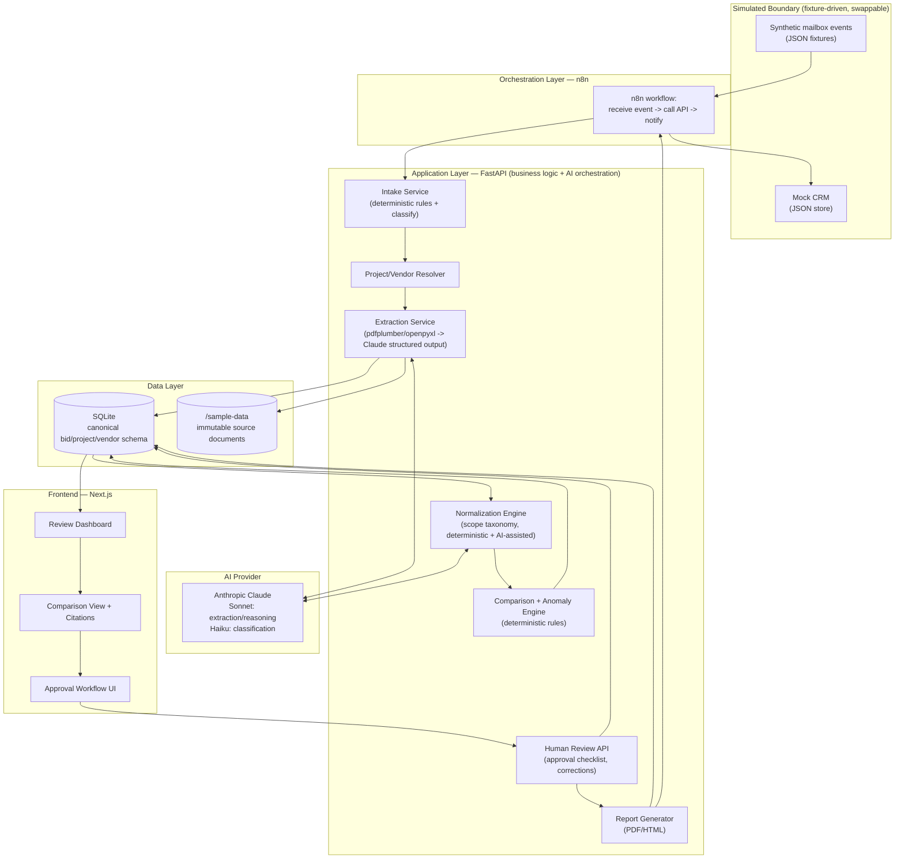
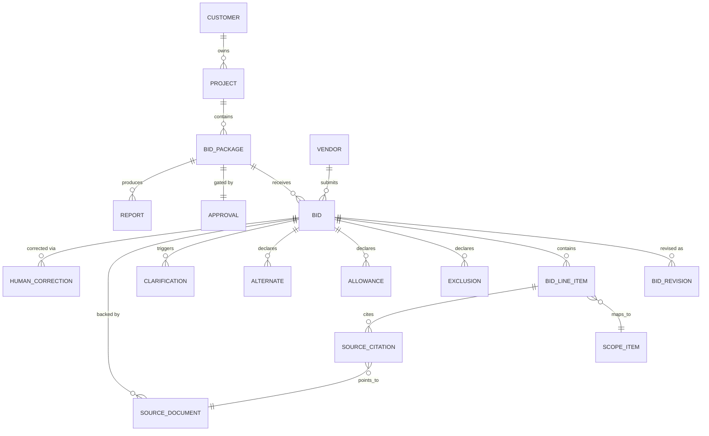
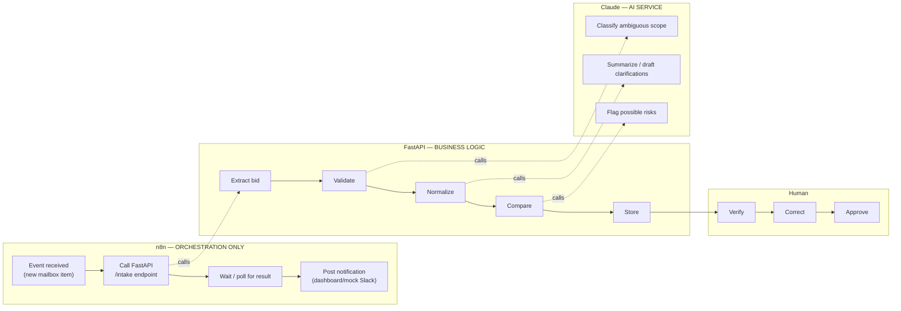

# Bid Intelligence & Procurement Copilot
## Architecture Review and Deployment Plan

**Reviewer role:** Principal AI Solutions Architect / Enterprise Automation Architect / Product Architect
**Input:** `Bid Intelligence & Procurement Copilot - Project Charter.md` (37 sections, Discovery/Concept stage)
**Date:** 2026-08-10
**Purpose:** Critically evaluate the charter, cut it down to a buildable v1, commit to a concrete architecture, and define the shortest credible path to a demo that creates a genuine "wow" moment — while leaving a clean seam to grow into a real production system.

---

## 1. Executive Architecture Assessment

The charter is unusually good discovery work. It correctly identifies the real business problem (lowest submitted price ≠ lowest true cost), it already separates deterministic logic from AI reasoning as a design principle, it insists on source lineage and human-in-the-loop approval, and it anticipates the simulation-to-production migration path instead of pretending the demo *is* the product. Most first-time AI product concepts don't get any of that right. This one gets all of it right and then keeps going for 37 sections.

**That's the core problem: the charter is a production system's requirements document, not a demo's.** It defines vendor performance scoring, change-order risk prediction, negotiation intelligence, multi-channel role-based digests, four candidate automation platforms, and a full audit/governance model — all before a single bid has been parsed. Every one of those ideas is legitimate. None of them is needed to prove the thesis. Left as-is, this charter is a recipe for six months of architecture debate and zero working software, which is exactly the failure mode a Principal Architect is supposed to prevent.

The second problem is that the charter makes no technology commitments. It lists SaaS automation platforms as "candidates" and never names a database, a backend framework, or an AI provider. A concept document is allowed to do that; an architecture review is not. Everything below commits to a specific stack, with the reasoning, so the project can start moving instead of continuing to survey options.

The third problem is subtler: **false precision.** Numeric confidence scores like "Exclusion Interpretation: 71%" imply the model has been calibrated against a labeled dataset large enough to justify a specific integer. It hasn't, and for a demo it never will be. Displaying invented precision is worse than displaying none — it's the kind of detail that makes an experienced reviewer (i.e., the enterprise buyer or the hiring manager this is ultimately for) trust the system *less*, not more, once they notice it. This is addressed in Section 2 and Section 15 (Q6).

**Bottom line:** the vision is right, the sequencing is wrong, and the stack is undecided. This document fixes sequencing and stack, and prunes the vision down to what one flagship scenario can actually prove.

---

## 2. Recommended Scope Changes

### KEEP

| Item | Why it stays |
|---|---|
| Full core workflow (intake → classify → match → extract → normalize → compare → anomaly detect → human review → report → CRM writeback) | This *is* the product. Cutting any stage breaks the story. |
| Source document preservation + per-field lineage/citations | This is the single most credible "enterprise AI" signal in the whole charter — cheap to build, expensive to fake convincingly if skipped. |
| Human approval checklist before "approving" a comparison | The core safety/governance claim of the product. Non-negotiable for the demo narrative. |
| One flagship scenario (Falcon Medical Center, Div. 26 Electrical) | Charter's own scenario is well-designed — see Section 6. |
| Structured JSON bid model as source of truth | Proves real data architecture, not just a chat UI over PDFs. |
| Golden-dataset evaluation harness | Differentiates this from a "prompted a demo" portfolio project. See Section 10. |
| Simulated mailbox / simulated CRM as fixture-driven events | Exactly the right call already in the charter (Section 26). Keep it, formalize it. |

### MODIFY

| Item | Charter version | Demo version | Why |
|---|---|---|---|
| Confidence scoring | Numeric percentages everywhere (97%, 71%, 92%) | Three tiers — **HIGH / REVIEW / LOW** — for every AI-derived judgment. Numeric scores allowed only where a real number exists (e.g., text-extraction character confidence from the PDF library, or a deterministic rule score). | Avoids fake precision (Section 1). Tiers route behavior identically to percentages but don't imply a calibration that doesn't exist. |
| Automation platform | Four candidates left open (Make, Zapier, Power Automate, n8n) | **n8n**, committed. | A demo needs one concrete, versioned, screenshot-able workflow — not a menu. See Section 7. |
| Required-scope cross-check | General "requirements matrix" engine | One hard-coded planted case (Section 6) proving the concept, not a generalized matching engine | The general engine is real production work; the demo only needs to prove the *value*, not ship the capability. |

### DEFER (real capability, wrong phase — production-only for now)

- Vendor performance history / award-rate / change-order scoring — **cannot be built honestly**: it requires many historical projects, and the demo has exactly one. Building it now means either faking a trend (bad for credibility) or building infrastructure with no data to prove it works.
- Change-order risk prediction (charter §21) — same problem, explicitly flagged as advanced/production in the charter itself. Agreed.
- Negotiation intelligence (charter §22) — depends on normalized multi-vendor pricing, which is a *downstream* deliverable of this same project. Natural phase-2 feature once the comparison engine exists.
- Real OAuth, RBAC, multi-tenant permissions, live Microsoft Graph/Gmail integration, live CRM (Procore/ACC/Dynamics/Salesforce) writeback.
- Full immutable audit ledger with cryptographic integrity guarantees.

### REMOVE from v1 (reconsider later, not part of the flagship demo)

- Role-based digest delivery via Teams/Slack/email (charter §19) — a real feature, but it's a distribution mechanism for data the demo already displays in the dashboard. It adds integration surface (Slack/Teams API, email sending) without adding to the "wow" moment. Cut for v1; the dashboard already role-filters.
- Predictive/statistical analytics beyond the anomaly rules in Section 13 of the charter.

### ADD (not in the charter, needed for portfolio credibility)

- **AI Responsibility Matrix** as a first-class, committed document (Section 4 below) — explicitly shows which tasks are AI vs. deterministic and why. This is the artifact a hiring manager or enterprise buyer looks for and the charter never quite produces.
- **CI-gated evaluation harness** (Section 10) — golden dataset + automated scoring running in GitHub Actions on every push. This is what turns "I used AI" into "I know how to operate AI in production," which is the actual differentiator for an AI Solutions Architect portfolio.
- **Simulation-to-Production interface map** (Section 11) — the charter gestures at this in §26/§35 but never makes it concrete per-component. Doing so is cheap and very high signal.

---

## 3. Proposed Demo Architecture



**Design rule enforced by this diagram:** the orchestration layer (n8n) never touches business logic directly — it only calls the FastAPI service. This is what lets n8n be replaced by Power Automate later, or the FastAPI service be called directly from a real Outlook add-in, without redesigning anything downstream. See Section 7.

---

## 4. AI Responsibility Matrix

| Task | Mechanism | Reason | Human Review Required? |
|---|---|---|---|
| Email/document intake filtering | Deterministic rules (sender domain, attachment presence, keywords) | Cheap, explainable, catches 90% of routing for free | No |
| Bid vs. non-bid classification | AI (Claude Haiku) | Requires language understanding rule-matching can't do reliably | Only on LOW confidence |
| Project / vendor matching | Deterministic fuzzy match first (name, domain, project #) → AI fallback for ambiguous cases | Most matches are exact or near-exact; AI only needed for genuinely ambiguous text | Always shown, mandatory on LOW confidence |
| PDF/Excel text & table extraction | Deterministic (pdfplumber, openpyxl) | Structural extraction is a solved, non-probabilistic problem — using AI here is slower, costlier, and less reliable | No |
| Bid total / line-item extraction from unstructured text | AI (Claude Sonnet, structured/tool-use output) | Requires reading prose and tables together; no fixed schema per vendor | Yes — always shown with citation, confirmation required before "approved" |
| Arithmetic validation of extracted totals | Deterministic (recompute from line items) | Arithmetic is not a language problem | No (flags automatically) |
| Scope normalization (mapping vendor language to canonical scope items) | AI-assisted, deterministic taxonomy as guardrail | Vendors use inconsistent terminology; AI maps to a fixed, human-curated scope taxonomy rather than inventing categories | Yes on REVIEW/LOW tier |
| Included/Excluded/Unclear/Not-found classification | AI (Claude Sonnet) with explicit not-found ≠ excluded distinction enforced in schema | Requires reading intent, not keyword matching | Yes, always visible |
| Revision detection & diffing | Deterministic (filename/sender/thread heuristics) + AI summary of what changed | Detection is rule-based; summarizing *why* it changed benefits from language generation | Summary is advisory only |
| Pricing anomaly detection (outlier vs. competitors, missing bonding, etc.) | Deterministic statistical rules | These are threshold/rule checks, not judgment calls | Flags shown, no gate |
| Required-scope cross-check (missing from all bidders) | Deterministic match against a curated spec checklist (v1 scope: 1 planted item) | v1 doesn't need a general NLP spec-parser to prove the value | Yes — this is the anomaly with the highest business stakes |
| Clarification question drafting | AI (Claude Sonnet) | Natural-language generation task | Yes — draft only, human must approve/edit before "sending" (simulated) |
| Adjusted/risk-normalized pricing | Deterministic calculation on human-entered adjustment values | Charter is explicit and correct: AI must never silently become the source of a price number | Yes — human enters the adjustment value; AI may only *suggest* |
| Executive summary generation | AI (Claude Sonnet) | Synthesis/writing task | Yes — reviewed before inclusion in report |
| Vendor risk assessment / negotiation intelligence | **Deferred to production** — not built in v1 | Needs real historical data across many projects | N/A |

---

## 5. Canonical Data Model

### Entities and demo scoping

| Entity | Demo v1 | Notes |
|---|---|---|
| Project | Required | 1 flagship project for demo |
| Customer | Required | Owner of the project (hospital system) |
| BidPackage | Required | Division 26 Electrical |
| Vendor | Required | 4 fictional subcontractors |
| VendorContact | Simplified — fields on Vendor | Full contact sub-entity is production-only (multiple contacts per vendor over time) |
| Bid | Required | One per vendor |
| BidRevision | Required | Vendor D submits a revision — this is part of the flagship scenario |
| BidLineItem | Required | Merged with ScopeItem pricing for v1 simplicity |
| ScopeItem | Required | Canonical taxonomy entries (rough-in, fixtures, permits, testing, etc.) |
| Exclusion | Required | Explicit Included/Excluded/Unclear/NotFound state per ScopeItem |
| Allowance | Required | Part of flagship scenario |
| Alternate | Required | Part of flagship scenario |
| Clarification | Required | Drives the clarification-loop demo beat |
| SourceDocument | Required | Immutable original files |
| SourceCitation | Required | Page/section pointer from every extracted value back to SourceDocument |
| AIAnalysis | Required, lightweight | Stored as structured fields on Bid/ScopeItem (tier, model, prompt version) rather than a heavyweight separate audit entity |
| HumanCorrection | Required, simplified | Append-only correction log — not a full immutable ledger |
| Approval | Required | The mandatory checklist from charter §16 |
| AuditEvent | Simplified — derived from HumanCorrection + Approval timestamps | Full production-grade audit trail is deferred |
| Report | Required | Generated PDF/HTML artifact |

### Entity relationships



Full JSON Schemas for `Bid`, `Vendor`, and `Project` will be produced at the start of Phase 1 (Section 9) — not before, since the schema should be driven by the actual fixture documents once they're written, not guessed in the abstract.

---

## 6. Demo Scenario

**Flagship project:** Falcon Medical Center Expansion — Bid Package: Division 26 Electrical — Estimated Budget: $185,000. Keeping the charter's own scenario; it's well-constructed. Specifying the exact planted defects so they're unambiguous to build and to verify against in the eval harness:

| Vendor | Format | Planted characteristic |
|---|---|---|
| **Apex Electrical Contractors** | 17-page PDF proposal | Strong scope coverage, priced ~8% above median. Includes permit fees, fixtures, testing. |
| **Voltage Systems Inc.** | Excel pricing workbook | **Lowest submitted price**, but excludes permit fees and fixture allowance — the "cheap but incomplete" trap the whole product exists to catch. |
| **Meridian Electric & Controls** | Pricing in email body + PDF scope letter | Contains an **arithmetic discrepancy** between the stated line-item sum and the stated total; also references an **outdated drawing revision** (Rev. 1 instead of the current Rev. 3). |
| **Ironclad Power & Electric** | PDF proposal, then a follow-up **Revision 1** after an addendum | Demonstrates revision tracking and the "material changes between revisions" summary. |

**Planted universal gap:** none of the four proposals mentions the arc-flash study required by Section 26 05 73 of the project specifications. This is the single most important beat in the demo — it proves the product catches a risk that *every* bidder missed and that a simple "compare four PDFs side by side" workflow never would.

**Why this scenario is sufficient and nothing more elaborate is needed:** it exercises every pipeline stage (four input formats, one exclusion trap, one arithmetic error, one stale-reference error, one revision, one universal gap) with a single coherent narrative a viewer can follow start to finish. Charter §34's success criteria are all satisfiable from this one scenario — no second project is needed for v1.

---

## 7. Automation Strategy

**Decision: n8n**, self-hosted (Docker, local for dev), for the visible orchestration layer.

| Platform | Verdict | Reasoning |
|---|---|---|
| **n8n** | **Chosen** | Workflows export as JSON and commit to the repo (`/automation/n8n/*.json`) — this is the only one of the four that produces something a GitHub reviewer can actually read and diff. Free, self-hostable, no vendor lock-in for the portfolio artifact. Strong Portfolio fit since it shows you can read/write workflow-as-code. |
| Make | Rejected for v1 | Genuinely the most visually polished canvas — worth a screenshot/GIF callout in the README as "also evaluated," but it's SaaS-proprietary; workflows don't version in git, and a free account doesn't reliably survive to demo day. |
| Zapier | Rejected | Weakest fit for branching, stateful, multi-step bid logic; better suited to simple two-step SaaS glue. |
| Power Automate | Rejected for v1, noted for production | Correct answer *if* the eventual customer is standardized on Microsoft 365/Outlook/SharePoint/Dynamics — worth one paragraph in Section 11 as the real production target, not worth building against now. |

**Division of responsibility (this is the most important governance rule in the whole automation design):**



n8n never contains a scope-comparison rule, a pricing calculation, or a prompt. If it can't be described as "receive → call → wait → notify," it doesn't belong in the n8n canvas — it belongs in FastAPI. This is what makes the automation demonstrable *and* replaceable.

---

## 8. Repository Architecture

```text
bid-intelligence-copilot/
├── README.md
├── docs/
│   ├── product-vision.md          # trimmed version of the charter
│   ├── architecture.md            # this document's §3, kept in sync
│   ├── ai-governance.md           # this document's §4 + §12
│   ├── demo-scenario.md           # this document's §6
│   ├── evaluation-plan.md         # this document's §10
│   └── security-model.md          # this document's §12
├── sample-data/
│   ├── company/                   # fictional GC brand, roles, employees
│   ├── projects.json
│   ├── vendors.json
│   ├── emails/                    # synthetic mailbox fixtures
│   ├── bids/                      # PDFs, xlsx per vendor
│   ├── specifications/
│   └── addenda/
├── schemas/
│   ├── bid.schema.json
│   ├── vendor.schema.json
│   └── project.schema.json
├── prompts/
│   ├── classify-email.md
│   ├── resolve-project.md
│   ├── extract-bid.md
│   ├── normalize-scope.md
│   ├── analyze-anomalies.md
│   └── generate-clarifications.md
├── automation/
│   └── n8n/
│       └── *.json                 # exported workflows
├── src/
│   ├── intake/
│   ├── extraction/
│   ├── normalization/
│   ├── comparison/
│   ├── reporting/
│   └── api/                       # FastAPI app
├── web/                           # Next.js dashboard
├── tests/
│   ├── fixtures/
│   ├── extraction/
│   ├── normalization/
│   └── regression/
├── eval/
│   ├── golden/                    # gold-standard answer set
│   ├── harness.py
│   └── reports/
└── .github/workflows/
    └── eval.yml                   # CI-gated evaluation run
```

Change from the charter's proposed structure: `eval/` is promoted to a top-level directory (not buried under `tests/`) because the evaluation harness is a headline deliverable (Section 10), not incidental test coverage. `docs/requirements.md` is dropped as its own file — the trimmed charter *is* `product-vision.md`, and this document *is* `architecture.md`; no separate requirements doc is needed for a solo-built demo.

---

## 9. Phased Deployment Plan

### Phase 1 — Synthetic World-Building & Data Model
**Business objective:** Make the fictional company and scenario credible enough to carry the whole demo.
**Technical objective:** Lock the canonical schema before any pipeline code depends on it.
**Features:** Fictional GC company profile (name, brand, roles, employees, numbering conventions), 4 vendor profiles, the flagship project record, JSON Schemas for Project/Vendor/Bid.
**Technologies:** Markdown + JSON only. No code yet.
**Deliverables:** `sample-data/company/*`, `schemas/*.json`, `docs/demo-scenario.md`.
**Definition of Done:** every entity in Section 5 has a schema; the fictional company reads as a real regional GC, not a parody.
**Tests:** JSON Schema validation on all fixture files.
**Demo capability unlocked:** none yet — this is foundation.
**Dependencies:** none.
**Risks:** over-polishing the brand instead of moving to the pipeline. Timebox this phase.
**What not to build yet:** any extraction or AI code.

### Phase 2 — Deterministic Intake & Extraction Plumbing
**Business objective:** Prove documents can be reliably ingested and stored with lineage before any AI is involved.
**Technical objective:** Build the boring, reliable half of the pipeline first.
**Features:** Synthetic email fixture format, PDF/Excel text+table extraction (pdfplumber/openpyxl), SourceDocument/SourceCitation storage.
**Technologies:** Python, FastAPI skeleton, SQLite/SQLAlchemy.
**Deliverables:** `src/intake/`, `src/extraction/` (structural extraction only), working SQLite schema.
**Definition of Done:** running the intake script against all 4 vendor fixtures produces stored SourceDocument records with correct page-level text extraction — no AI calls yet.
**Tests:** extraction unit tests against known fixture text.
**Demo capability unlocked:** "the system ingests real bid documents and preserves them immutably."
**Dependencies:** Phase 1 schemas.
**Risks:** scanned/image-heavy PDFs needing OCR — avoid by hand-crafting fixtures as text-based PDFs.
**What not to build yet:** AI extraction, UI, comparison logic.

### Phase 3 — AI Extraction, Classification & Eval Harness v1
**Business objective:** Prove AI extraction is reliable enough to trust, and prove it with tests, not vibes.
**Technical objective:** Wire Claude into the pipeline behind a structured-output contract, and stand up the eval harness immediately alongside it.
**Features:** Email classification, project/vendor matching, structured bid-total/scope extraction with citations, confidence tiers.
**Technologies:** Anthropic Claude (Sonnet + Haiku), tool-use/structured output.
**Deliverables:** `src/extraction/ai_extract.py`, `prompts/*.md`, `eval/golden/`, `eval/harness.py`, first GitHub Actions run.
**Definition of Done:** eval harness runs against all 4 vendor bids and reports per-field accuracy against golden answers; CI passes.
**Tests:** the eval harness itself, run in CI on every push.
**Demo capability unlocked:** "the system extracts bid totals and scope with cited sources, and its accuracy is continuously measured."
**Dependencies:** Phase 2 plumbing, Anthropic API key.
**Risks:** prompt drift breaking extraction silently — mitigated by the eval harness existing from day one of AI code, not bolted on later.
**What not to build yet:** comparison/normalization across vendors, UI.

### Phase 4 — Normalization, Comparison & Anomaly Engine
**Business objective:** Deliver the actual "lowest price ≠ lowest cost" insight — this is the core value proposition.
**Technical objective:** Build the deterministic comparison and rule-based anomaly engine on top of normalized AI-classified scope data.
**Features:** Scope taxonomy normalization, Included/Excluded/Unclear/NotFound matrix, adjusted pricing calculation, arithmetic validation, pricing-outlier detection, the one planted required-scope gap check, revision diffing.
**Technologies:** Pure Python business logic, no new infra.
**Deliverables:** `src/normalization/`, `src/comparison/`.
**Definition of Done:** running the full pipeline against all 4 vendors produces a comparison object correctly flagging all 5 planted defects from Section 6.
**Tests:** regression tests asserting each planted defect is detected.
**Demo capability unlocked:** "the system produces a normalized bid comparison and flags the anomalies a human would otherwise have to find manually."
**Dependencies:** Phase 3 structured bid records.
**Risks:** over-generalizing the scope taxonomy — keep it scoped to Division 26 Electrical terms actually present in the fixtures.
**What not to build yet:** vendor history/negotiation intelligence (deferred per Section 2).

### Phase 5 — Human Review UI & Approval Workflow
**Business objective:** Make the human-in-the-loop story visible and interactive, not just asserted in a doc.
**Technical objective:** Ship a dashboard that surfaces AI output, citations, confidence tiers, and a mandatory approval checklist.
**Features:** Project/bid dashboard, comparison matrix view with click-through citations, correction workflow, approval checklist (charter §16 items), clarification draft/approve UI.
**Technologies:** Next.js, Tailwind, calling the FastAPI service.
**Deliverables:** `web/` app.
**Definition of Done:** a reviewer can open the Falcon project, see all 4 bids compared, click any figure to see its source citation, correct one AI misclassification, and complete the approval checklist end to end in the browser.
**Tests:** basic component/integration tests; manual walkthrough against the golden scenario.
**Demo capability unlocked:** the full "wow" moment — this is what gets recorded for the portfolio.
**Dependencies:** Phase 4 comparison engine.
**Risks:** scope creep into a full design system — keep the UI clean and use Tailwind defaults rather than custom component libraries.
**What not to build yet:** role-based multi-user auth (single implicit reviewer role is fine for v1).

### Phase 6 — Reporting & Simulated CRM Writeback
**Business objective:** Close the loop — approved analysis has to *go* somewhere, or the workflow feels incomplete.
**Technical objective:** Generate a professional report artifact and simulate the CRM update.
**Features:** PDF/HTML bid-leveling report generation, mock CRM JSON store + "activity" record showing the report attached to the project.
**Technologies:** A PDF templating library (e.g., WeasyPrint) or HTML-to-PDF, plus the existing FastAPI service.
**Deliverables:** `src/reporting/`, `sample-data/mock-crm/`.
**Definition of Done:** approving the Falcon comparison in the UI produces a downloadable report and a visible "CRM activity" entry.
**Tests:** report generation snapshot test.
**Demo capability unlocked:** "approved analysis writes back to the system of record" — even though the CRM is mocked, the interface contract matches what Section 11 maps to a real CRM API.
**Dependencies:** Phase 5 approval workflow.
**Risks:** none significant.
**What not to build yet:** real CRM OAuth integration.

### Phase 7 — Automation Visualization Layer
**Business objective:** Make the enterprise-automation story (the part of this that's explicitly for the portfolio) visible and screenshot/recording-ready.
**Technical objective:** Wire n8n workflows to the FastAPI endpoints per Section 7's orchestration/business-logic split.
**Features:** n8n workflow: mailbox event → intake API → notify; second workflow: approval → report → mock CRM API.
**Technologies:** n8n (Docker).
**Deliverables:** `automation/n8n/*.json`, a short screen recording/GIF of the workflow running live.
**Definition of Done:** triggering a new fixture "email" causes the n8n canvas to visibly execute each step and the FastAPI pipeline to run as a result.
<br>
**Tests:** manual end-to-end run, recorded.
**Demo capability unlocked:** the visual automation proof that's core to Jeff's stated learning objective.
**Dependencies:** Phases 2–6 all functioning via API.
**Risks:** treating n8n as a place to "quickly" add logic — resist; keep it orchestration-only per Section 7.
**What not to build yet:** production webhook security (signing, retries, dead-lettering) — note it in docs as a production concern, don't build it.

### Phase 8 — Portfolio Packaging & CI Evaluation Hardening
**Business objective:** Make the repository itself the deliverable a hiring manager reads.
**Technical objective:** Finish the golden dataset, harden CI, and write the narrative documentation.
**Features:** Full golden dataset covering all extraction/classification/detection tasks from Section 10, CI eval gating (fail the build below an accuracy threshold), polished README with architecture diagram, demo GIF/video, all `docs/*.md` files finalized.
**Technologies:** GitHub Actions, existing stack.
**Deliverables:** complete repo per Section 8, public GitHub URL.
**Definition of Done:** a stranger can clone the repo, read the README, and understand the architecture, the AI/deterministic split, and the evaluation results without running anything.
**Tests:** full eval suite green in CI.
**Demo capability unlocked:** portfolio-ready public artifact.
**Dependencies:** all prior phases.
**Risks:** perfectionism — timebox documentation polish.
**What not to build yet:** multi-project/multi-tenant scaling, live deployment hosting (a local `README`-documented run is sufficient; a hosted live demo is a nice-to-have stretch goal, not a requirement).

---

## 10. Evaluation Plan

Because every document in `sample-data/bids/` is authored by us, the correct answer is known before extraction ever runs. This is the project's biggest structural advantage and the charter under-uses it (§31 mentions it as one of 37 sections; it deserves to be a headline feature).

**Gold dataset:** for each of the 4 vendor bids, hand-author a `golden/<vendor>.json` containing the exact expected bid total, scope-item classifications, exclusions, the arithmetic-error flag, the stale-drawing-reference flag, and (for Ironclad) the revision diff. For the universal gap, one `golden/required-scope.json` records the expected "arc-flash study missing from all bidders" finding.

**What gets measured:**

| Test | Metric | Gate |
|---|---|---|
| Email/document classification | Accuracy vs. gold label | ≥ 95% (small, hand-built set — should be near-perfect) |
| Project matching | Accuracy | 100% (deterministic-first design means this should never miss) |
| Vendor matching | Accuracy | 100% |
| Bid total extraction | Exact match to gold value | 100% — this is a number, not a judgment call, and must be exact |
| Scope classification (Included/Excluded/Unclear/NotFound) | Per-field accuracy | ≥ 90%, all misses reviewed manually |
| Exclusion detection | Recall on planted exclusions | 100% on the planted cases |
| Revision identification | Correct revision detected + correct diff summary generated | Detection: 100%; summary: human-graded pass/fail |
| Arithmetic validation | Correctly flags the planted discrepancy | 100% — deterministic recomputation, not AI |
| Required-scope detection | Flags the planted universal gap | 100% |
| Citation accuracy | Every extracted value's citation points to the correct page/section | ≥ 95% |
| Unsupported claims / hallucination rate | Any AI-asserted fact with no traceable citation | 0 tolerated in the golden set — any occurrence is a CI failure |

**Automation:** `eval/harness.py` runs the full pipeline against the fixture set, diffs output against `eval/golden/`, and writes a scored report to `eval/reports/`. `.github/workflows/eval.yml` runs this on every push and fails the build if the bid-total, arithmetic-validation, or required-scope-detection gates aren't 100% (those three are non-negotiable; they're deterministic or near-deterministic by design, and a regression there is a real bug, not model variance).

---

## 11. Simulation-to-Production Map

| Simulated in demo | Production replacement | Migration note |
|---|---|---|
| Synthetic email JSON fixture | Microsoft Graph API (Outlook) or Gmail API | n8n trigger node swaps; FastAPI `/intake` contract unchanged |
| Mock CRM JSON store | Procore, Autodesk Construction Cloud, Dynamics 365, or Salesforce API | Reporting service's writeback interface stays the same; only the adapter implementation changes |
| Local `/sample-data` files | SharePoint, S3, or Azure Blob Storage | SourceDocument storage is already behind a repository interface — swap the implementation, not the schema |
| Fixture-driven vendor "reply" events | Live inbound-email thread monitoring | Same n8n trigger pattern as the initial intake event |
| SQLite | PostgreSQL (e.g., via Supabase or managed RDS) | SQLAlchemy models are DB-agnostic; this is a connection-string and migration-tool change |
| Manual fixture trigger ("run the demo script") | Real webhook / scheduled polling | n8n already models this as an event trigger — production just points it at a real source |
| Generated PDF attached to mock CRM record | CRM's native document-attachment API | Same reporting service, different upload adapter |
| Single implicit reviewer role | Real RBAC (per-project permissions, SSO/OAuth) | Approval entity already has a `reviewed_by` field — production adds an auth layer in front of it, doesn't restructure it |
| n8n self-hosted (Docker, local) | n8n Cloud, or Power Automate if the customer is Microsoft-standardized | Business logic never lived in the orchestrator, so this swap doesn't touch `src/` at all — this is the payoff of Section 7's separation rule |

---

## 12. Security and Governance Review

**Build now (cheap, and establishes the right habits/architecture):**
- Secrets (Anthropic API key, etc.) in environment variables / `.env`, never committed — add `.gitignore` entry before first commit.
- Source documents and derived records kept strictly separate in the schema (Section 5) so "source truth vs. AI interpretation vs. human decision" (charter §30) is a structural fact, not a UI convention.
- HumanCorrection log is append-only (no update/delete path in the API) — cheap to build now, expensive to retrofit later, and it's the mechanism that makes the governance story real rather than asserted.
- Mandatory approval checklist gate (Section 9, Phase 5) before a comparison can be marked "approved."
- Basic input validation on all API boundaries (FastAPI/Pydantic gives this by default — use it, don't bypass it for speed).
- Document a prompt-injection stance even though it's not fully mitigated in v1: uploaded PDF/Excel content is treated as untrusted text passed to Claude for extraction only, never as instructions the pipeline executes. Structured/tool-use output constrains what the model can affect.

**Defer to production (explicitly, in `docs/security-model.md`, not silently dropped):**
- Real authentication/authorization, RBAC, project-level permissions, SSO.
- Encryption-at-rest for the database (SQLite file has no built-in encryption; production Postgres would use provider-managed encryption).
- Malware/attachment scanning on real inbound documents.
- Formal model-provider data retention review (Anthropic's API-tier data handling terms, at the point real customer data is involved).
- Full immutable/cryptographically-verifiable audit ledger.

**Do not overbuild now:** none of the above deferred items should be half-implemented in the demo. A partial RBAC system that isn't actually enforced is worse than clearly documenting "production adds RBAC here" — half-built security theater is a red flag to any technical reviewer, more so than an honestly-scoped demo.

---

## 13. Cost-Control Strategy

| Concern | Approach |
|---|---|
| Infrastructure cost | $0 — SQLite, local FastAPI/Next.js, self-hosted n8n via Docker. No cloud hosting required to build or demo locally. |
| AI cost — extraction | Use Claude Sonnet only for the extraction/normalization calls that need real reasoning; run deterministic text extraction (pdfplumber) *first* so the model receives already-parsed text/tables, not raw PDF bytes — this cuts input tokens substantially versus vision-based extraction. |
| AI cost — classification | Use Claude Haiku for cheap, high-volume tasks (email classification, simple matching) — reserve Sonnet for extraction and synthesis where reasoning quality matters. |
| AI cost — repetition | Cache extraction results per document hash; never re-run extraction on an unchanged fixture. The eval harness should reuse cached AI outputs between runs unless prompts changed, and only hit the live API when a prompt/version actually changes. |
| Vision/OCR fallback | Only invoked if deterministic text extraction yields near-empty output (i.e., a scanned image) — since demo fixtures are authored as text-based PDFs, this path should rarely if ever fire, keeping it a documented capability rather than an actual recurring cost. |
| Batch processing | Not needed at demo scale (4 vendor bids); documented as a production lever (Anthropic Batch API) for when the pipeline processes hundreds of bids overnight. |
| CI cost | GitHub Actions free tier is sufficient at this scale; eval harness should use cached AI outputs in CI where possible (re-running live extraction on every push is unnecessary once outputs are stable — only re-run live when prompt files change). |
| What to postpone entirely | Postgres/Docker-Compose multi-service deployment, any paid hosting (Vercel/Render/Fly), and Supabase — all namely because a local, well-documented `README` walkthrough is sufficient for a portfolio demo; add hosting only if a live public URL becomes a specific goal later. |

---

## 14. First Vertical Slice

**Goal:** prove the entire architectural spine — deterministic extraction → AI structured extraction with citations → canonical schema storage → source-truth/AI-interpretation separation → automated verification — at the smallest possible scope, before building comparison, UI, or automation.

**Scope:**
1. One static fixture: a synthetic "email event" JSON referencing Apex Electrical's PDF proposal (`sample-data/bids/apex_electrical_proposal.pdf`, hand-authored with a known base bid, one clear inclusion, one clear exclusion, each with a page/section location).
2. A script (`src/intake/run_single.py` or equivalent) that: reads the fixture → runs deterministic PDF text extraction → calls Claude with a structured-output prompt to extract `{ base_bid, scope_items: [...], exclusions: [...] }` with page citations → validates the output against `schemas/bid.schema.json` → writes the result to a `Bid` row in SQLite.
3. One pytest test asserting the extracted base bid total, the one scope inclusion, and the one exclusion exactly match a hand-authored `eval/golden/apex.json`.
4. Console output (no UI yet) printing the result with fields explicitly labeled **Source Truth** (raw extracted text), **AI Interpretation** (the classification), and their citation — making the Section 12/§30 distinction visible even in a bare terminal run.

**Definition of Done:**
- Running one command ingests the Apex fixture end-to-end and prints a structured bid record with citations.
- `pytest` passes a test asserting the three gold values above match exactly.
- No UI, no comparison logic, no automation layer, no second vendor — those are explicitly out of scope for this slice and belong to Phases 2–7.

This slice deliberately touches every architectural boundary (document → deterministic extraction → AI extraction → schema validation → storage → automated check) without touching any feature that requires more than one vendor. It's the fastest possible proof that the spine in Section 3 actually works before investing in the features built on top of it.

---

## 15. Immediate Next Actions

1. **Approve or amend the scope/stack decisions in Sections 2, 3, and 7** — everything downstream depends on these being settled, not revisited mid-build.
2. **Author the Phase 1 fixtures**: fictional company profile, 4 vendor profiles, the Falcon project record, and the JSON Schemas (Section 5, Section 9 Phase 1). This is pure writing/data work, no code.
3. **Author the 4 vendor bid documents** (PDF/Excel/email) with the planted defects from Section 6 baked in exactly as specified, plus the corresponding `eval/golden/*.json` answer files.
4. **Build the First Vertical Slice** (Section 14) — the single smallest proof of the architecture, before any comparison logic or UI work starts.
5. **Stand up the eval harness alongside the vertical slice**, not after it — Section 3/Phase 3 depends on this habit starting on day one of AI code, not being retrofitted once extraction "seems to work."

---

## Final Review

**1. Are we solving the right problem?**
Yes. "Lowest submitted price is not lowest true cost, and the manual process to find that out doesn't scale" is a real, well-understood pain point in construction procurement, and the workflow the charter describes is the correct shape of solution for it (extract → normalize → compare → flag → human-approve), not an AI-washed version of something simpler.

**2. What is the strongest part of this concept?**
The charter's own instinct to separate deterministic logic from AI reasoning, and to make source lineage a first-class citizen (§7, §30). Most people building "AI does document review" projects skip both and end up with an opaque black box. This concept doesn't, and that's the thing worth protecting most carefully through implementation.

**3. What is currently overengineered?**
Vendor intelligence, change-order prediction, and negotiation intelligence (charter §20–22) — all three require historical data across many projects that a one-project demo cannot honestly produce. Also, four candidate automation platforms where one was needed, and numeric confidence scores implying a calibration precision that doesn't exist yet.

**4. What is currently underdeveloped?**
The evaluation strategy (charter §31) is mentioned once in passing among 37 sections when it should be a headline feature — it's the thing that proves "AI systems should be evaluated, not merely prompted," which is Jeff's own stated goal for the repository. Section 10 above promotes it accordingly. The concrete technology stack was also entirely undeveloped — every recommendation in Section 3/7/9 fills that gap.

**5. What would make this project impressive to an enterprise AI employer?**
A CI pipeline that runs a real evaluation harness against a golden dataset and fails the build on regressions; a clean, enforced separation between orchestration (n8n) and business logic (application code); explicit, visible source citations on every extracted value; and documentation that shows *why* things were cut, not just what was built. That last point — the reasoning trail — is what this document itself models.

**6. What would make it look amateurish?**
Fake-precision confidence percentages with no calibration behind them; an automation "demo" that's just a screenshot with no versioned, runnable workflow; AI-estimated numbers presented indistinguishably from vendor-submitted numbers; a comparison engine that can't explain why it flagged something; a repo that's all frontend polish with no tests or evaluation.

**7. What should NOT be included in Version 1?**
Vendor performance history/scoring, change-order risk prediction, negotiation intelligence, real OAuth/RBAC/multi-tenant auth, live email/CRM integration, role-based digest delivery via Slack/Teams/email, and a general-purpose spec-cross-check engine (v1 proves the concept with one planted gap, not a full matching system).

**8. What technical decision is most important to get right early?**
The orchestration/business-logic boundary (Section 7). If comparison or pricing logic leaks into the n8n canvas even once, the "replace one component without redesigning the system" promise (charter's own working principle) breaks, and that promise is the whole point of the simulation-to-production strategy.

**9. What is the shortest path to a demo that creates a genuine "wow" moment?**
The First Vertical Slice (Section 14) proves the spine works, but the actual wow moment is Phase 5: opening the dashboard, seeing four differently-formatted bids normalized into one comparison, clicking the lowest bidder's price and watching it visibly lose to a bidder who included the missing scope — and then seeing the arc-flash study gap that *none* of the four bidders caught. That single screen is the entire pitch.

**10. If you were personally responsible for shipping this demo, what would you build first?**
Exactly what Section 14 specifies: one vendor, one document, extraction with citations, one passing test — before touching comparison logic, UI, or n8n. It's tempting to start with the dashboard because it's the most visible, but building the review screen before the extraction pipeline it depends on produces impressive-looking mockups over real state, which is the opposite of what this project is trying to prove.
